제1장 테스트 개요
1.1     테스트  목적

테스트는 시스템이 정해진 요구사항을 만족하는지 확인하고, 주어진 표준 등을 준수하는 지 검증하기 위하여 수행된다. 좀 더 구체적으로 말하면 테스트의 목적은 결함 검출, 품질 평가, 프로세스 개선이라고 볼 수 있다.
∙ 결함의 검출과 제품 품질 개선: 테스트는 결함을 검출하기 위한 목적으로 수행될 수 있 다. 그리고 검출된 결함을 제거함으로써 결국은 소프트웨어의 품질을 개선하는 것이 목 표이다.
∙ 품질 평가와 의사 결정 지원: 소프트웨어 또는 시스템에 대한 품질을 평가하기 위한 목적 으로 테스트를 실시한다. 즉, 테스트 결과를 바탕으로 성능, 신뢰성, 보안성 등의 다양한 소프트웨어 품질 특성에 대한 충족 수준을 평가하고, 품질 평가 결과를 바탕으로 소프트 웨어 제품에 대한 의사 결정을 수행할 수 있다.
∙ 개발 프로세스 개선 지원: 소프트웨어 개발 과정 중 어떤 단계에서 결함이 발생하는지 분 석하고, 그러한 결함이 왜 검출되지 않았는지 파악함으로써 개발 프로세스 개선을 도울 수 있다. 예를 들어, 검출된 결함 중에서 요구사항 관련 결함이 많다면 요구분석 단계의 프 로세스 개선이 필요하며, 요구분석 단계에서의 결함 검출 방법도 개선할 필요가 있다.

--

1.2     오류,  결함,  장애
1.2.1    오류, 결함, 장애의 개념
소프트웨어를 개발할 때 기대⋅약속된 소프트웨어의 동작에 대한 기준이 주어지는데, 이 동작 기준을 정의한 것을 소프트웨어 요구사항이라고 한다. 예를 들어, 차량에 설치된 AV시스템이라면, ‘USB가 삽입되었을 때, 삽입된 USB에 포함된 오디오 또는 비디오가 재생 되어야 한다.’라는 소프트웨어 요구사항이 있을 수 있다.
만약, 소프트웨어가 요구사항과 다르게 동작했다면 이를 장애(Failure)가 발생했다고 한 다. 앞에서 든 예시, ‘USB가 삽입되었을 때, 삽입된 USB에 포함된 오디오 또는 비디오가 재생되어야 한다.’라는 요구사항이 있는 AV시스템에 USB가 삽입되었는데도 USB가 인식 되지 않거나, 인식은 되지만 USB에 포함된 오디오 또는 비디오가 재생되지 않는다면 이 시스템에 장애가 있다고 판단할 수 있다. 즉, 장애는 프로그램의 실행 결과와 요구사항에 명시된 결과에 (관찰 가능한) 차이가 있음을 의미하는 것이다.
이러한 장애는 결국 소프트웨어를 구성하는 요소에 부족한 점이 있어서 발생한 것이다. 이 는, 부정확한 구현 때문일 수도 있고, 필요한 기능이 포함되지 않았기 때문일 수도 있다. 이와 같이, 소프트웨어 내에 장애를 유발할 수 있는 문제를 결함(Defect)이라고 한다. 이렇 게 결함 때문에 장애가 발생하지만 결함이 있다고 해서 반드시 장애가 발생하는 것은 아니 다. 이에 대한 자세한 내용은 1.1.2. 결함 유형에서 확인해보자.
그리고 이러한 결함이 생기게 한 개발자의 행위를 오류(Error)라고 한다. 사용자의 요구사 항을 잘못 파악⋅이해하여 발생하는 실수, 오타(typo)나 프로그램 명령어를 잘못 이해하 여 코딩하는 경우 등이 오류에 해당한다.
1.2.2    결함 유형
테스트를 통하여 결함을 효과적⋅효율적으로 검출하기 위해서는 먼저 소프트웨어에 어떤 종류의 결함이 존재할 수 있는지 이해해야 한다. 그림 1.1은 소프트웨어 결함을 누락, 비관 련, 부정확한 구현이라는 세 가지 유형으로 분류한 개념을 보여 준다.

--

∙ 누락(Omission)은 요구 명세에 명시된 요구사항이 시스템의 구현에 반영되지 않은 결함 을 말한다. 예를 들어, 어떤 시스템의 요구 명세에 특정 입력에 대하여 ‘A’를 출력하도록 명시되어 있지만 소프트웨어에는 구현되지 않았다면 이는 누락에 해당한다. 누락 결함에는 기능적인 것뿐만 아니라 성능, 보안, 안전, 신뢰도 등 품질 요소에 관한 누락도 포함된다.
∙ 부정확한(Incorrect) 구현은 요구 명세에 명시된 요구사항이 소프트웨어에 부정확하게 반영된 결함을 뜻한다. 예를 들어, 요구 명세에서 특정 입력에 대해 ‘A’를 출력하도록 명 시되어 있지만 소프트웨어에는 ‘B’가 출력되도록 구현되어 있다면, 이는 부정확한 구현 결함에 해당한다. 부정확한 구현 결함에는 기능적인 것뿐만 아니라 성능, 보안, 안전, 신 뢰도 등 품질 요소에 관한 부정확한 구현도 포함된다.
∙ 비관련(Extraneous) 결함은 요구 명세와 관련되지 않은 구현을 말한다. 예를 들어, 소스 코드에서 어떤 부분이 요구 명세에 언급된 기능⋅품질 등과 무관하다면 비관련 결함에 해 당한다. 비관련 결함은 당장 직접적인 장애(Failure)를 유발하지 않을 수도 있다. 하지만 시스템의 기능⋅품질에 기여하지 않는 무의미한 코드가 존재한다면 이는 불필요한 분석⋅ 테스트⋅관리의 노력을 유발하고 결국에는 다른 결함을 초래하는 원인이 될 수 있다.
그림 1.2는 부정확한 구현, 누락 그리고 비관련 유형의 결함을 실제 소스 코드로 설명한 것이다. 

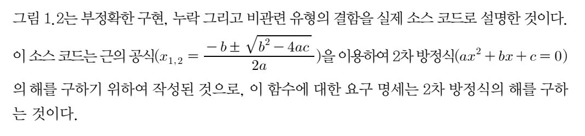
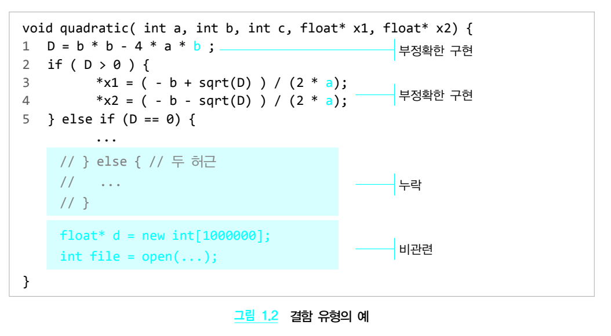)

--
예제 코드의 첫 문장에서는 판별식(D)(  )를 계산하고 있다. 그런데 판별식은 b*b – 4*a*c이므로 위의 예제 코드와 같이 b*b– 4*a*b로 작성한 것은 ‘부정확한 구현’ 유형의 결함에 해당한다. 그리고 세 번째 문장과 네 번째 문장의 근의 공식에서 분모를 2 * a 로 할 때 만약 2차 항의 계수 a의 값이 0이 되는 경우에는 분모가 0이 되어 ‘Divide By Zero’가 발생하게 된다. 이 또한 부정확한 구현의 결함이다.
위의 코드에서 두 개의 허근을 가질 경우에 대한 코드가 주석(Comment)으로 표시되었어 야 한다.  2차 방정식을 위한 요구 명세에는 판별식이 음수인 경우 두 개의 허근을 구해야 하는데 이것이 소스 코드에 구현되어 있지 않은 것이다. 그러므로 이는 ‘누락’ 유형의 결함 이라고 볼 수 있다.
그리고 마지막 두 문장에는 메모리를 할당하고 파일을 여는 코드가 구현되어 있는데, 이 동 작은 2차 방정식의 해를 구하는 요구사항에 해당되지 않는다. 그러므로 이 두 개의 문장은 ‘비관련’ 유형의 결함이다.
1.2.3    개발 단계별 결함
지금까지의 설명으로 보면 결함이 마치 소스 코드에만 존재한다고 생각할 수 있다. 하지만 결함은 소스 코드를 포함해서 최종적으로 소프트웨어 동작의 장애를 유발할 수 있는 모든 개발 산출물에 존재할 수 있다. 예를 들어, 소스 코드에서 발견된 결함이 소스 코드를 작성 하는 구현 단계가 아니라 설계 명세서의 부정확한 알고리즘에 기인한 것일 수도 있는데, 이 러한 경우에는 소스 코드의 결함이라기보다는 설계의 결함이라고 볼 수 있다.
일반화하면 개발자는 소프트웨어를 개발하는 각 단계에서 오류를 범할 수 있으므로 각 단 계의 산출물에는 결함이 존재할 가능성이 있는 것이다. 그림 1.3은 전체 결함에 대하여 소 프트웨어 주요 개발 단계별 결함의 발생 비율을 보여 준다.1) 전체 결함의 35%가 코딩 단계 의 오류에 따른 것이고, 요구분석 단계에서 20%, 설계 단계에서 25%의 결함이 발생함을 알 수 있다. 참고로 결함 해결 오류는 결함을 해결하는 과정에서 새롭게 발생한 결함의 비 율을 의미한다.

--
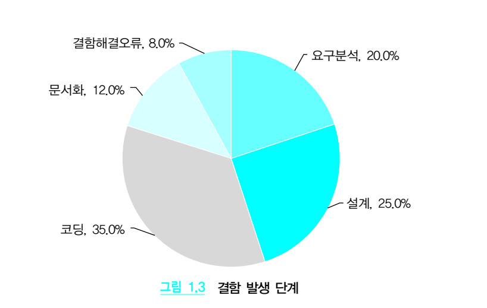)

결함이 발생했을 때, 해당 단계에서 적절하게 검출하여 제거하지 않으면 이후 단계를 거쳐 소스 코드에 영향을 미치며 결국에는 장애를 유발하게 된다. 게다가 결함이 발생한 시점에 제거되지 않고 이후 개발 단계에 그대로 전달되면 이 결함을 제거하기 위하여 더 많은 비용 이 소요된다. 그림 1.4는 소프트웨어 개발 단계에 따라 결함을 제거하는 데 소요되는 비용 을 상대적인 수치로 나타낸 것이다.2) 예를 들어, 요구분석 단계에서 결함을 해결하면 0.1 에서 0.2 정도의 비용이 소요되지만 이를 코딩 단계에서 제거하려면 1의 비용이 소요되고, 인수 테스트 단계에서는 5의 비용이 소요된다. 유지보수 단계에서는 심지어 20의 비용이 소요됨을 알 수 있다.
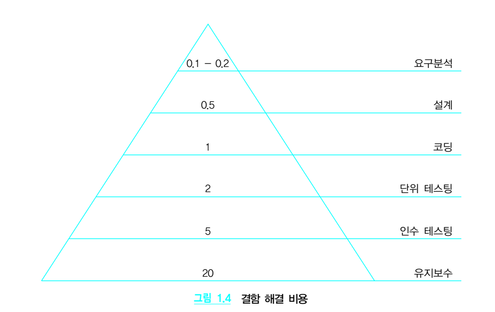)

--

그러므로 결함 해결에 소요되는 비용을 최소화하기 위해서는 각 개발 단계의 결과물을 테 스트하여 해당 산출물에 존재하는 결함을 최대한 빨리 검출하고 제거해야 한다.
1.2.4    테스팅, 디버깅, 재테스팅
결함, 테스팅과 관련된 용어로 디버깅(Debugging)이 있다. 디버깅은 테스팅과 다른 개념이며 혼동하여 사용하지 않아야 한다. 그림 1.5는 테스팅과 디버깅의 관계를 개념적으로 나타낸 것이다. 

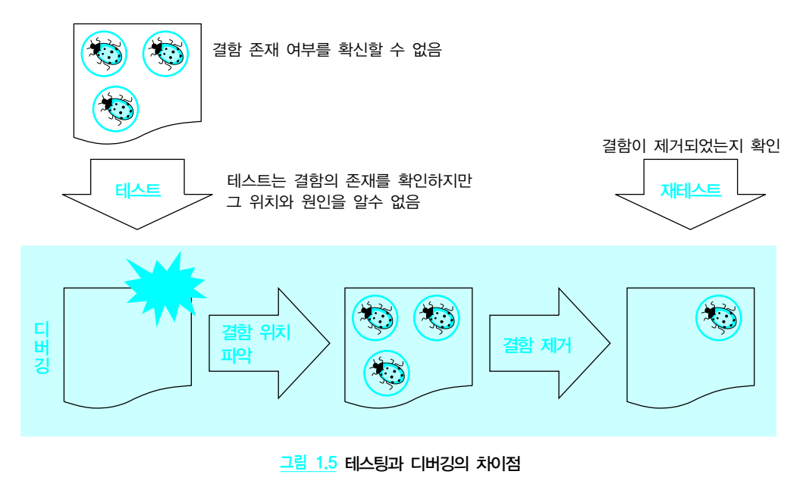)

❏ 테스팅
테스팅은 소프트웨어의 실제 동작과 요구사항과의 차이를 확인한다. 특히, 동적 테스트는 결함의 존재 여부를 알 수 없는 상황에서 결함의 발견을 목적으로 프로그램을 실행한다. 프 로그램이 예상 결과와 다른 결과를 보일 때, 즉, 소프트웨어에 장애가 있을 때 테스팅에서 는 해당 프로그램 내부에 결함이 존재한다고 추측한다. 다시 말해서 장애 발생을 확인하여 소프트웨어에 결함이 있음을 간접적으로 판단하는 것이다.
테스팅의 결과는 결함을 검출한 테스트 케이스와 테스트 환경이다. 즉, 테스팅은 어떤 환 경에서 어떤 입력값을 사용하였을 때 예상되는 결과와 실제 출력 결과 등을 기록하지만 이 결함이 소프트웨어의 어떤 모듈에서 발생하였고 이를 해결하기 위하여 소스 코드를 어떻 게 수정해야 하는지에 대하여 관여하지 않는다.

--
❏ 디버깅
디버깅은 테스팅을 통하여 결함의 존재를 확인한 후에 수행되며 결함의 위치를 파악하고 이를 제거하는 것을 목적으로 한다. 테스팅을 통해 어떤 입력값에 대한 결함이 있음을 알게 되면 디버깅에서는 해당 결함과 관련된 소스 코드의 위치를 찾아야 한다. 일반적으로 결함 을 검출한 입력값을 이용해서 소프트웨어를 동작시킬 때 실행된 소스 코드에 결함이 존재 한다.
일단 결함의 위치를 알아내면 해당 결함을 제거하기 위해서 소스 코드를 수정해야 한다. 이 작업은 단순히 코드의 철자를 바로잡는 것일 수도 있고, 알고리즘의 부정확한 구현을 정확 하게 수정하는 것일 수도 있으며 요구분석에 명시되었으나 누락된 기능을 추가하는 것일 수도 있다.
❏ 재테스팅
개발자가 결함을 제거하기 위해서 코드를 수정하고 나면 실제로 결함이 제거되었는지 확 인을 해야 한다. 이를 위해 초기에 결함을 검출한 테스트 케이스를 이용하여 테스팅을 다시 수행하는데, 이를 재테스팅(Re-testing)이라고 한다.
--

1.3     테스트의  현실/실제

1.3.1    완벽한 테스트의 비현실성
테스트를 통하여 결함을 검출하려면 많은 수의 테스트 케이스가 필요하다. 예를 들어, 2차 방정식 프로그램에서 (a=1, b=2, c=1) 하나만을 입력하는 것은 부족하다. (a=1, b=2, c=2) 또는 (a=1, b=-2, c=1) 등과 같이 다양한 입력값을 테스트 케이스로 준비해야 한다.
소프트웨어의 어느 코드에 결함이 있는지 미리 알 수 없으므로 가능한 한 모든 입력값을 사 용하여 결함을 찾아야 한다. 그러나 간단한 소프트웨어인 경우에도 거의 무한한 입력값을 가질 수 있다. 예를 들어, 2차 방정식 프로그램은 a, b, c의 값을 2바이트 정수로 제한하더 라도 2^16×2^16×2^16 경우의 수가 존재한다.
그림 1.6은 워드(Word)의 글꼴 메뉴 항목을 지정하는 대화상자이다. 워드가 글꼴을 지정
한 대로 보여주는지 확인하려면 모든 가능한 글꼴, 글꼴 스타일, 크기, 글꼴 색 및 효과 등 의 상호 조합을 고려하여 테스트해야 한다.

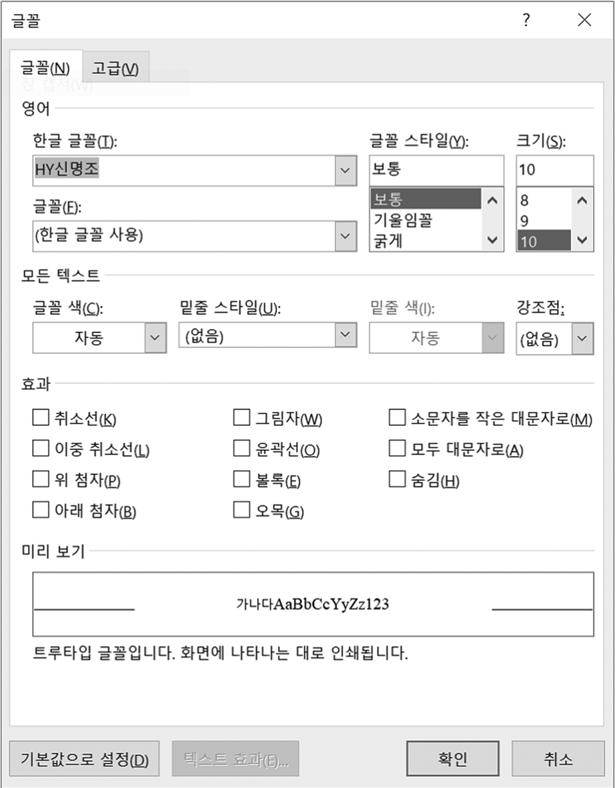

그림 1.6  워드의 글꼴 대화 상자
하지만 이 모든 조합을 테스트하는 것은 현실적으로 불가능하다. 예를 들어, 글꼴 개수 30 개, 글꼴 스타일 5개, 크기 21개라고 가정하면 30×5×21=3,150가지의 경우가 생기며, 글꼴 색, 밑줄 스타일 및 효과까지 지정할 수 있으므로 엄청난 경우의 수가 생긴다. 
프로그램 테스트의 한계를 조금 더 쉽게 이해하기 위해 낚시와 비교하여 생각해보자. 일정한 시간 동안(평생 낚시만 할 수 없으므로, 예를 들면, 가져온 미끼를 다 사용하는 동안) 저수지 에서 낚시를 할 때 물고기가 계속 잡히지 않을 수 있다. 이 경우에 저수지에 정말 물고기가 없어서 안 잡힐 수도 있고 물고기가 있는데 낚시 실력이 부족해서 안 잡힐 수도 있다. 그렇다 면 이 저수지에는 물고기가 없다고 단정적으로 말할 수 있을까? 이렇게 말하려면 저수지 물 을 전부 없애고 정말 물고기가 없는지 살펴보아야 한다. 현실적으로 불가능한 이야기이다. 낚시에서 사용되는 미끼를 테스트 데이터라고 생각하고 저수지의 물고기를 프로그램의 결

--

함으로 간주하여 생각해보자. 미끼를 다 사용할 때까지 물고기가 안 잡히는 상황은 선정된 테스트 집합에 대해 프로그램이 모두 올바르게 실행되는 경우에 해당한다. 이 경우에 저수 지에 물고기가 없다고 단정적으로 말할 수 없듯이 프로그램에 결함이 없다고 말할 수 없다. 이와 같은 프로그램 테스트 기술의 한계를 다익스트라(Dijkstra)는 다음과 같이 표현하였 다.3)
“프로그램 테스트는 결함이 있음을 보일 수는 있지만, 결함이 없음을 보일 수는 없다.” “Program testing can be used to show the presence of bugs, but never their absence.”
따라서 주어진 인력과 시간을 바탕으로 최대한 효과적이고 효율적인 테스트를 수행할 수 있도록 체계적인 테스트가 수행되어야 한다. 특히, 소프트웨어를 실행하는 방식으로 수행 되는 동적 테스트에서는 너무나 많은 경우의 수가 있으므로 효과적이면서 효율적인 테스 트는 중요한 이슈이다.
∙ 동적 테스트에는 이러한 테스트의 한계를 충분히 고려하여 테스트 케이스를 설계하는 ‘동등 분할’, ‘경곗값 분석’, ‘조합 테스트’ 등의 다양한 방법이 존재한다.
∙ 또한, 위험 기반 테스트 방법을 적용할 수도 있다. 테스트 대상에서 테스트할 각각의 특 성에 대한 위험 분석을 바탕으로 테스트할 범위를 선정하고 이에 따라 테스트 전략을 수 립함으로써 한정된 비용과 일정 내에서 테스트의 효과를 최대화할 수 있다.
1.3.2    테스트의 진화 과정
겔퍼린(Gelperin)과 헤첼(Hetzel)은 소프트웨어 테스트 개념의 진화 과정을 다음의 5개 레벨로 나누어 설명하였다.4)
레벨 1 (Debugging-oriented, ~1956년) 테스트와 디버깅에 뚜렷한 차이가 없는 레벨이 다. 우연히 발견된 결함을 수정하는 디버깅에 중점을 두며 프로그램의 결함을 찾기 위한 별 도의 노력을 기울이지 않는다.

레벨 2 (Demonstration-oriented, 1957~1978) 프로그램이 올바르게 동작한다는 사실 을 입증하기 위해 테스트를 수행한다. 따라서 결함을 찾을 확률이 높은 테스트 케이스를 설 계하기보다는 시스템의 정상 작동을 증명하는 데 초점이 맞추어진 테스트 케이스를 설계 하는 경향이 있다.
레벨 3 (Destruction-oriented, 1979~1982) 프로그램에 결함이 존재함을 보여주기 위 해 테스트를 수행한다. 프로그램이 잘 작동하지 않는다는 사실을 보여주려는 의도로 테스 트 케이스를 설계하므로 프로그램의 결함을 발견하는 테스트 케이스가 그렇지 못한 테스 트 케이스보다 훨씬 더 가치 있다는 인식이 있다.
레벨 4 (Evaluation-oriented, 1983~1987) 레벨 3의 테스트가 실제 프로그램 코드에 있 는 결함을 발견하는 것에 초점을 맞춘다면 레벨 4의 테스트는 소프트웨어 개발 전 단계에 서 발생하는 결함을 발견하는 개념으로 확장한다. 따라서 코딩이 완료된 후에 테스트를 시 작하는 것이 아니라 개발 초기 단계부터 지속적으로 리뷰 등을 통해 시스템을 평가하는 작 업을 수행해야 한다는 개념이다.
레벨 5 (Prevention-oriented, 1988~) 이 레벨에서 테스트의 목적은 프로그램의 결함을 사후에 발견하는 것이 아니라 아예 결함이 발생하지 않도록 사전에 방지하는 것이며, 프로 그램을 개발할 때 처음부터 테스트가 용이하도록 시스템을 설계해야 한다는 개념을 추구 한다. 결함을 미연에 방지하기 위한 가장 효과적인 방법은 테스트 케이스를 미리 설계하는 것이다. 실제로 테스트 주도 개발(Test-Driven Development, TDD)에서는 테스트 케이 스를 미리 설계하고 코딩을 나중에 하는 방식으로 시스템을 개발한다.
1.3.3    테스트 원칙
G. J. 마이어스(G. J. Myers) 등은 “The Art of Software Testing”에서 기본적으로 테스 트를 수행할 때 따라야 할 원칙을 소개하였다. 여기서는 그중 중요한 몇 가지 원칙을 소개 한다.5)
테스트는 반드시 프로그램을 개발한 프로그래머나 팀과는 무관한 그룹이 수행해야 한다. 사람의 심리 상 자신이 작성한 프로그램에 대해서는 방어적 경향을 띨 수밖에 없다. 또한, 자신이 담당한 부분의 요구사항을 제대로 해석하지 못했을 가능성이 있으므로 테스트를 

철저하게 수행하더라도 결함을 발견하지 못할 가능성이 크다.
결함이 발견되지 않으리라는 가정하에 테스트 계획을 수립해서는 안 된다. 테스트는 프로그램이 올바르게 동작함을 보여주는 작업이 아니라 결함을 발견하려는 의도로 프로 그램을 실행하는 과정이기 때문이다. 이는 겔퍼린(Gelperin)과 헤첼(Hetzel)의 레벨 3 (Destructionoriented) 테스트 개념에 해당한다.
타당한 경우뿐만 아니라 타당하지 않고 예상하지 못한 경우에 대해서도 테스트를 수행하 라. 일반적으로 프로그램을 작성할 때 타당한 조건을 만족하는 입력들만 고려하여 테스트 하는 경향이 있다. 그러나 프로그램이 예상하지 못한 방식으로 사용되는 경우에 많은 결함 이 발생한다. 예를 들어, 정숫값을 입력으로 받아들이는 프로그램에서 문자열을 입력하면 프로그램이 제대로 동작하지 않는다.
프로그램의 어떤 부분에 결함이 남아있을 확률은 그 부분에서 이미 발견된 결함의 수에 비 례한다. 이는 파레토(Pareto) 원칙으로 다음과 같이 설명될 수 있다. 
“프로그램 결함의 80%는 20%의 모듈에서 발생한다.”
실제로 많은 프로그램에서 이러한 현상이 관찰되었다. 이러한 현상의 원인은 무엇일까? 프로 그래머가 모듈을 작성할 때 엉망으로 코딩하여 결함투성이 모듈이 됐을 수도 있고 소프트웨 어 설계나 구조 자체에 심각한 문제가 있어 발견된 결함들이 결국 동일한 원인으로 발생했을 수도 있다. 이 원칙은 결함이 많이 발생한 부분에 테스트 노력을 집중하는 편이 효과적임을 시사한다.
테스트 케이스를 체계적으로 관리하라. 테스트 케이스 설계는 시간과 노력이 많이 투입되 는 작업이다. 만약 프로그램이 여러 가지 이유로 수정되었다면 올바르게 프로그램이 수정 되었는지, 프로그램 수정으로 인하여 기존의 기능이 영향을 받았는지 다시 테스트해야 한 다. 이를 위하여 새로운 테스트 케이스를 만들려면 많은 작업량이 필요하므로 기존에 만들 었던 테스트 케이스를 재사용하여 테스트하는 것이 바람직하다. 
각각의 테스트 결과를 철저하게 점검하라. 당연하게 들리겠지만, 각각의 테스트 케이스 실 행 결과를 철저하게 점검해야 한다. 지금 발견한 결함이 앞서 수행했던 테스트 케이스에서 발견되었는데도 지나치는 경우가 있다. 조금만 더 주의 깊게 각 테스트 결과를 점검하면 결 함의 발견 확률을 높일 수 있다는 의미이다.
--
1.4     테스트와  품질

1.4.1    테스트와 품질 평가
테스트 목적에서 기술하였듯이 품질 평가도 테스트 목적의 하나이다. 즉, 소프트웨어 품질 을 평가할 때 테스트를 활용할 수 있다. ISO 25010에서는 표 1.1과 같이 소프트웨어 품질 의 유형을 8개 주특성과 각 주특성에 따른 하위 품질 특성으로 정의하고 있다.
표 1.1  ISO 25010의 품질 특성 분류

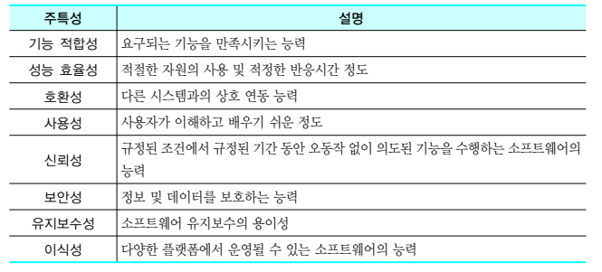

요구사항 명세는 대표적으로 기능 요구사항과 품질 요구사항을 포함한다. 즉, 소프트웨어는 기능적인 동작뿐만 아니라 성능, 호환성, 사용성 등의 품질 특성에 대한 요구를 충족해야 한 다. 그러므로 테스트를 수행할 때는 소프트웨어의 기능적 측면에 더하여 이러한 비기능적 측 면의 결함을 검출해야 한다. 이때, 기능 요구사항에 중점을 둔 테스트를 기능(Functional) 테스트라고 부르며, 품질 요구사항에 초점을 둔 테스트를 비기능(Non-functional) 테스 트라고 부른다.
성능, 신뢰성, 사용성 등의 각 품질 특성은 근본적으로 상이하고 각 품질 특성을 테스트하 는 방법도 서로 다르므로 각 품질 특성별로 테스트를 수행한다. 성능을 확인하기 위하여 성 능 테스트를 수행하고 보안성을 확인하기 위해서 보안 테스트를 수행하듯이 각 품질 특성 별로 수행되는 테스트를 유형 테스트라고 한다. 즉, 유형 테스트는 성능 테스트, 보안 테스 트, 신뢰성 테스트 등의 테스트를 부르는 용어이다.

--
1.4.2    테스트와 품질 보증
테스트와 관련된 용어로 V&V(Verification and Validation)와 품질 보증이 있다. 그림 1.7은 이 3가지 용어의 포함관계를 보여 준다.
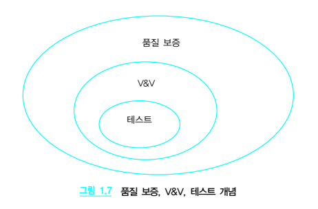

그림 1.7  품질 보증, V&V, 테스트 개념
V&V는 “Verification(검증)과 Validation(확인)”의 약어로서 소프트웨어 품질 보증을 위 한 핵심 개념이다. 검증은 소프트웨어 개발 과정에서 수행한 활동의 적합성 검사에 초점을 두며 확인은 결과물의 적합성에 초점을 둔다. 예를 들어, 요구 분석 단계의 결과물인 요구 사항 명세서가 구조 설계 및 상세 설계의 결과물에 적절하게 반영되었는지를 조사하는 추 적성 확인은 검증에 해당되고, 반면에 동작하는 소프트웨어가 주어진 요구사항을 충족하 는지 확인하는 것은 확인에 해당된다.
V&V는 테스트를 포함하여 다양한 방법으로 수행될 수 있다. IEEE Std. 1012-2012 IEEE Standard for System and Software Verification and Validation에서는 요구 분 석 단계, 설계 단계, 구현 단계 등의 개발 단계별로 적용할 수 있는 V&V 방법을 제시한다. 예를 들어, 요구 분석 단계에 적용할 수 있는 V&V 방법으로는 요구사항 평가, 인터페이스 분석, 추적성 분석, 심각성 분석 등이 있다.
ISO/IEC/IEEE 29119-1의 부록에서는 테스트를 포함한 V&V 활동의 분류를 소개한다. 그림 1.8은 29119-1 표준에서 제시하는 V&V 활동을 보여 준다. V&V는 정형 방법, 테스팅, 그리고 V&V 분석으로 분류된다. 정형 방법에는 모델체킹과 정확성 증명이 있으며, 테스팅 은 동적 테스팅과 정적 테스팅으로 분류된다. 그리고 V&V 분석의 유형으로는 시뮬레이션과 평 가가 있다.

--

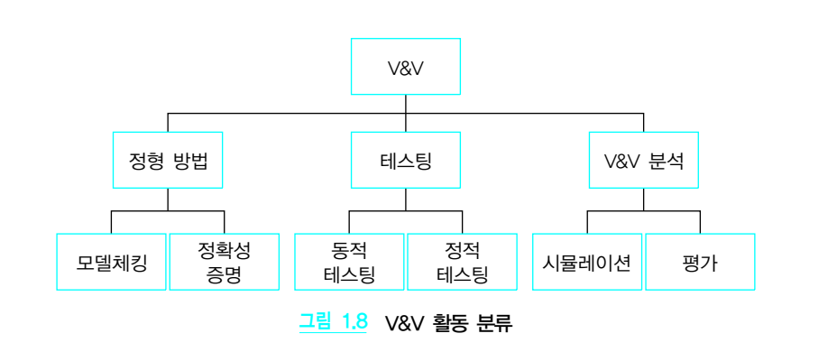
소프트웨어 생명 주기 프로세스에 대한 표준인 ISO/IEC 12207:2017에서는, 품질 보증이 란, 의도한 목적에 적합한 품질의 소프트웨어 제품을 개발하였는지, 그리고 그러한 소프트 웨어 프로세스가 적합한지에 대한 확신을 주기 위하여 수행되는 다양한 활동이라고 정의 하고 있다. 그러므로 품질 보증은 소프트웨어 제품의 품질뿐만 아니라 프로세스의 품질을 포함한다는 측면에서 V&V보다 광범위하다고 볼 수 있다.
그림 1.9는 IEEE Std. 730-2014 IEEE Standard for Software Quality Assurance Processes 의 소프트웨어 품질 보증 활동 범위를 보여 준다. 그림에서 볼 수 있듯이 품질 보증은 규칙⋅규 제⋅법규 등을 포함한 이해관계자의 요구사항을 바탕으로 프로세스와 시스템⋅소프트웨어 개 발 측면에 대한 모든 것을 포함한다. 즉, 프로세스 요구사항과 시스템 요구사항이 이해관계자 요구사항과 부합하는지, 소프트웨어 요구사항이 시스템 요구사항에 부합하는지, 프로세스와 표준 및 절차가 프로세스 요구사항에 부합하는지, 프로세스 활동의 수행이 프로세스, 표준 및 절차에 부합하는지, 소프트웨어가 소프트웨어 요구사항에 부합하는지 등을 확인한다.

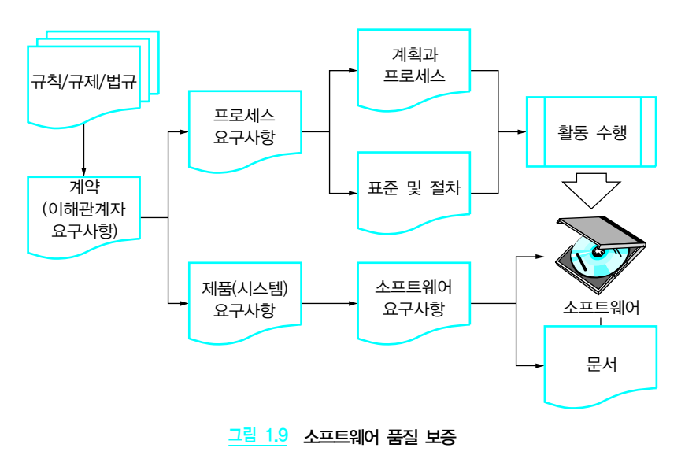

--
1.5     테스트  기본  용어

테스트를 체계적으로 수행하려면 기본적인 테스트 용어와 테스트 방법을 숙지해야 한다. 그림 1.10은 동적 테스트를 수행할 때 반드시 이해해야 할 기본 용어를 보여 준다.

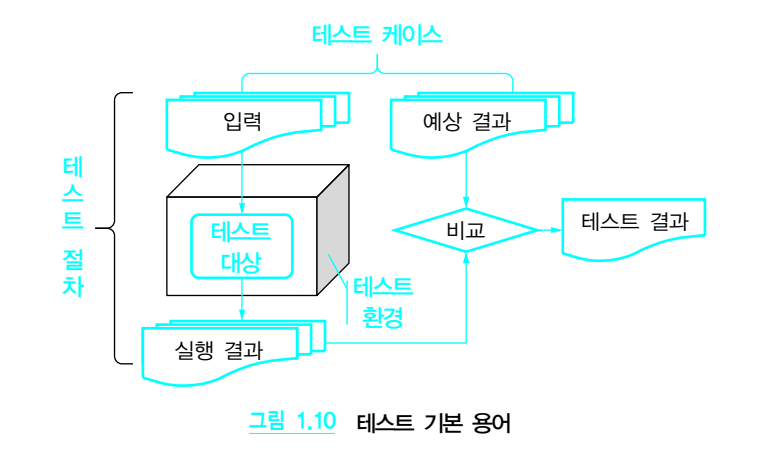

--

1.5.1    테스트 대상과 테스트 레벨
테스트 대상(Test item)은 테스트를 통해 결함을 검출하려는 대상 소프트웨어를 뜻한다. 시스템을 구성하는 전체 소프트웨어가 테스트 대상이 될 수도 있고 전체 소프트웨어의 일 부분이 대상이 될 수도 있다. 예를 들어, 차량 소프트웨어는 차량 전체 소프트웨어가 테스 트 대상이 될 수 있으며, 에어백, 크루즈 컨트롤 같은 부분 소프트웨어가 테스트 대상이 될 수도 있다.
차량 소프트웨어처럼 규모가 큰 대상 전체를 한 번에 테스트하여 결함을 찾거나 디버깅하 는 것은 쉽지 않다. 그래서 일반적으로 에어백 컴포넌트, 크루즈 컨트롤 컴포넌트와 같이 전체 시스템의 일부분을 먼저 테스트한 후에 각 부분을 통합하여 전체를 대상으로 테스트 를 수행하는 것이 효과적이다.
그림 1.11은 테스트 대상별로 수행되는 3가지 레벨의 테스트를 보여 준다. 일반적으로 전 체 소프트웨어를 대상으로 한 테스트를 시스템 테스트라고 하고, 부분을 대상으로 한 테스 트를 컴포넌트(Component) 테스트 또는 단위(Unit) 테스트라고 한다. 그리고 시스템을 구성하는 각 부분의 연결에 초점을 둔 테스트를 통합 테스트라고 한다. 반대로 말하면 시스 템 테스트를 수행할 때 테스트 대상은 전체 소프트웨어이고 컴포넌트 또는 단위 테스트를 수행할 때 테스트 대상은 시스템의 부분이다.

--
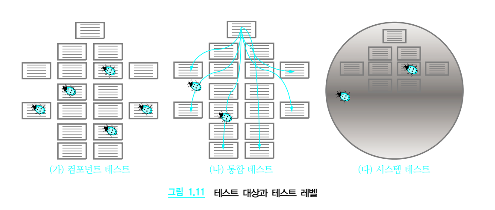

이와 같이 테스트 대상에 따라서 수행되는 컴포넌트 테스트, 통합 테스트, 시스템 테스트 등을 통칭하여 레벨 테스트라고 부른다.
1.5.2    피처와 테스트 유형
피처(Feature)는 테스트 대상의 특성 중에서 테스트하고자 하는 측면⋅관점을 뜻한다. 그 림 1.12는 자동차를 대상으로 한 피처의 예를 보여 준다.
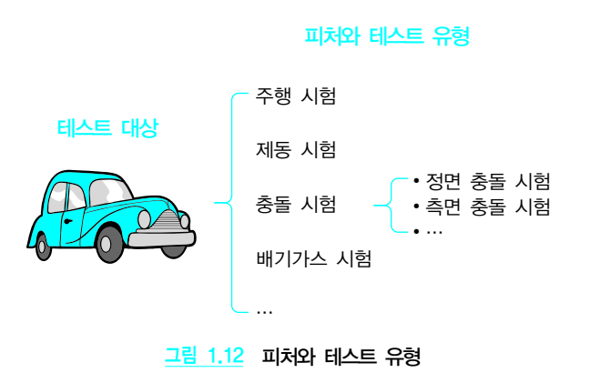

차량을 대상으로 테스트를 수행한다고 가정할 때, 즉, 차량에 존재하는 결함을 검출하려고 
할 때, 차량의 다양한 관점⋅측면이 조사되어야 한다. 예를 들어, 주행 시험 관점에서는 정
상 노면과 눈⋅비에 젖은 노면에서 운전대가 향하는 방향으로, 가속 페달을 누르는 강도에 
따라 차량이 주행하는지 테스트하고, 제동 시험 관점에서는 제동 장치를 구동하면 약속된 
거리 이내에서 차량이 멈추는지 테스트할 수 있다. 그리고 충돌 시험에서는 정면 방향 또는 측면 방향으로 충돌할 때 탑승자에 미치는 영향을 테스트할 수 있다.
차량 대상 테스트에서 주행, 제동, 충돌 등의 관점으로 테스트를 수행하듯이 소프트웨어도 다양한 측면⋅관점으로 테스트가 수행될 수 있다. 
이러한 다양한 측면⋅관점의 소프트웨어에 대한 기대⋅요구는 요구분석 단계를 거쳐 요구 사항 명세서에 기록된다. 그림 1.13은 요구사항 명세서에 기술된 기능 요구사항 및 품질 요구사항을 기준으로 테스트 기법을 분류한 것이다. 예를 들어, 요구사항 명세서에 성능 요구사항이 명시되었다면 성능 테스트를 수행해야 하고, 보안 요구사항이 명시되었으면 마찬가지로 보안 테스트를 수행해야 한다.
--

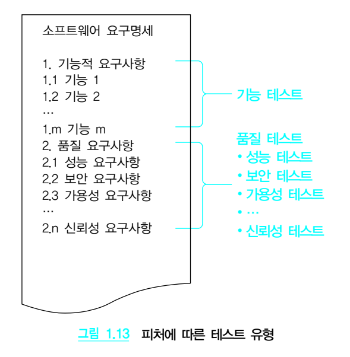

그림 1.13  피처에 따른 테스트 유형
피처는 테스트 계획을 수립할 때 식별되어 테스트 범위로 기술된다. 그리고 테스트 설계 활 동을 통해 피처가 구체화되며 이를 기준으로 테스트 케이스 및 테스트 절차가 개발된다.
1.5.3    테스트 설계 기법
테스트 설계 기법은 테스트 대상의 결함을 효과적으로 그리고 효율적으로 검출하기 위한 것으로, 정적 테스트를 수행하기 위한 기법과 동적 테스트를 수행하기 위한 기법으로 분류 된다.

1.5.3.1    정적 테스트
정적 테스트는 테스트 대상을 실행하지 않고 테스트를 수행하는 방식이다. 대표적인 방법 으로는 리뷰(Review)와 정적 분석(Static analysis)이 있다.
∙ 리뷰는 각 개발 단계별로 해당 단계의 산출물이 품질 목표에 부합하는지 점검하거나 산 출물에 존재하는 결함을 검출하려는 목적으로, 산출물을 실행하지 않고 검사하는 방법이 다. 예를 들면, 요구사항 단계가 종료된 시점에 고객으로부터 받은 요구사항이 누락되지 않고 요구사항 단계에 정확하게 반영되었는지 검토하는 활동이 이에 해당된다.
∙ 정적 분석은 소스 코드를 대상으로 결함으로 판단할 수 있는 특정한 패턴이 소스 코드에 있는지 분석한다. 예를 들어, 변수를 초기화하지 않고 그 값에 접근하려고 하는 패턴은 소프트웨어 결함이라고 볼 수 있으므로 소스 코드를 분석하여 초기화하지 않고 사용되는 변수를 파악함으로써 결함을 검출한다.
정적 테스트는 테스트 대상을 실행하지 않기 때문에 테스트 대상에 대한 실행 환경을 필요 로 하지 않는다는 장점이 있다. 또한, 소스 코드가 작성되기 이전의 개발 단계, 즉, 요구 분 석 단계, 구조 설계 단계, 상세 설계 단계 등에서 산출물에 대한 테스트를 수행할 수 있다는 장점이 있다. 이와 같이, 소스 코드를 작성하기 전에 요구사항이나 설계 수준에서의 결함 을 검출하고 해결하는 것은 소스 코드가 작성된 후에 결함을 검출하고 해결하는 것보다 훨 씬 경제적이다.
정적 분석은 자동화 도구를 활용함으로써 테스트를 자동으로 수행할 수 있다는 장점이 있 다. 자동화된 도구를 이용하여 대규모 소스 코드 분석이 가능하므로 사용이 증가하는 추세 이다. 특히, 프로그래밍 개발표준인 MISRA C, MISRA C++, JSF AV C++ 등은 자동차, 항공기를 포함하여 안전이 중요시되는 소프트웨어 개발에 필수로 요구되어 자동화된 도구 의 사용이 일반적이다.
그러나 자동화 도구는 결함이 아닌 문제를 결함으로 보고하는 오검지(False positive)의 단점이 있다. 이러한 오검지 비율이 높아지게 되면 개발자가 도구의 테스트 결과 자체를 신 뢰하지 않는 부작용이 발생할 수 있다.

--

1.5.3.2    동적 테스트
동적 테스트는 정적 테스트와 달리 테스트 대상, 즉, 소프트웨어를 실행하는 방식으로 테 스트를 수행하여 결함을 검출한다. 요구사항은 어떤 입력에 대한 기대 결과를 명시한다. 따라서 소프트웨어를 실행하여 해당 입력을 넣었을 때 요구사항의 기대 결과와 다른 결과 가 발생하는 경우 소프트웨어에 결함이 있다고 판단할 수 있다.
동적 테스트를 수행하는 방법은 명세 기반 방법, 구조 기반 방법, 그리고 경험 기반 방법이 있다.
∙ 명세 기반 방법은 프로그램의 내부 논리 구조를 참조하지 않고 사용자의 요구 명세나 설 계 정보 등을 이용하여 테스트 케이스를 개발한다. 명세 기반 테스트는 대상 시스템의 명 세 정보를 얻을 수 있는 한 적용 대상에 제한이 없으며 컴포넌트 테스트, 통합 테스트, 시 스템 테스트 및 인수 테스트 등 전 과정에 걸쳐 사용될 수 있다.
∙ 구조 기반 방법은 프로그램의 제어 흐름이나 자료 흐름 정보를 이용하여 테스트 케이스 를 설계하는 방법이다. 구조 기반 테스트는 프로그램의 내부 구조 정보를 기반으로 테스 트 케이스를 설계한다는 측면에서 구조적 테스트(Structural test), 화이트박스 테스트 (White box test) 또는 글래스 박스 테스트(Glass-box test)라고도 한다.
∙ 경험 기반 테스트는 테스트 케이스 설계를 바탕으로 테스트를 수행하지 않고 도메인에 대한 테스터의 경험, 기존 테스트 결과, 테스터의 직관을 주로 활용하여 테스트를 수행한다. 경험 기반 테스트의 대표적인 방법으로는 오류 추정(Error guessing)과 탐색적 테스트 (Exploratory test)가 있다.
동적 테스트는 실행 가능한 소프트웨어가 필요하며 소스 코드는 사용되지 않는다. 따라서 소스 코드가 없는 경우에도 수행할 수 있다는 특징이 있다. 예를 들어, 전체 소프트웨어를 구성하는 일부 컴포넌트를 외주 업체를 통해서 개발하는 경우 소스 코드를 제공받지 못할 수 있다. 이런 경우에는 앞에서 설명한 정적 테스트를 수행할 수는 없지만 실행 가능한 컴 포넌트가 제공되므로 동적 테스트를 수행할 수 있다.
동적 테스트는 소스 코드가 없어도 수행 가능하다는 장점이 있지만, 소프트웨어를 실행시 키기 위한 환경이 요구된다. 예를 들어, 네비게이션 소프트웨어에 대한 동적 테스트를 위 해서는 네비게이션 소프트웨어가 실행될 수 있는 환경인 운영체제, 라이브러리, GPS, DMB 수신기 등이 필요하다.

--
소프트웨어의 일부 요구사항은 정적 테스트로 확인하기 어려운 경우가 있다. 예를 들어, “USB가 삽입되었을 때 1초 이내에 재생되어야 한다.” 또는 “부팅 후 5초 이내에 현재 위치 를 표시해야 한다.” 같은 성능 요구사항은 코드 분석으로는 확인하기 어려우며 소프트웨어 를 실행해야 확인할 수 있다. 마찬가지로, 소프트웨어의 품질 요구사항인 가용성, 확장성, 신뢰성 등도 동적 테스트를 통해서 확인이 가능하다.
1.5.4    테스트 케이스
동적 테스트를 수행할 때는 테스트 대상을 실행하기 위해 적절한 입력값을 주어야 한다. 그 리고 테스트의 목적이 결함 검출임을 전제로 하면 결함의 검출 가능성이 큰 입력값을 결정 해야 한다. 예를 들어, 2차 방정식의 해를 구하는 프로그램에서는 (a=1, b=2, c=1)과 같이 적절한 값을 입력해야 한다.
그리고 특정한 입력값으로 테스트 대상을 실행하였을 때 기대되는 값도 결정해야 한다. 예를 들어, 2차 방정식의 해를 구하는 프로그램에 (a=1, b=2, c=1)이 입력되었을 때 기대되는 예 상 결과는 중근 -1이 된다. 테스트 대상을 실행하였을 때 기대되는 값을 결정해야 하는 이유 는 실제 출력이 예상 기댓값과 다른 경우 테스트 대상은 결함을 가지고 있다고 간주할 수 있 기 때문이다. 예를 들어, (a=1, b=2, c=1)을 입력값으로 하여 2차 방정식 프로그램을 실행 하였을 때 그 결과가 만약 1이라면 이 프로그램에는 결함이 있다고 판단할 수 있는 것이다.
그러므로 입력값에 대응되는 기대되는 예상값이 항상 결정되어야 한다. 이와 같이, 입력과 대응되는 예상 결과를 묶어서 일반적으로 테스트 케이스라고 부른다. 실제로 테스트 케이 스에는 입력값뿐만 아니라 입력값을 테스트 대상에 제공하는 방법, 그리고 예상 결과와 실 제 결과를 비교하는 방법도 포함된다.
1.5.5    테스트 절차
테스트를 수행하려면 테스트 환경이 구축되어야 하고 준비된 테스트 케이스의 입력값을 실제 테스트 대상에 입력하여 테스트 대상을 실행해야 한다. 그리고 테스트 대상의 동작을 관찰하여 실제 수행 결과를 추출하고 이를 테스트 케이스의 예상 결과와 비교해야 한다.
테스트를 객관적이고 효율적으로 수행하려면 이러한 과정을 명시적으로 정의하고 기록할 필요가 있다. 테스트 절차(Procedure)는 테스트를 준비하고, 실행하고, 결과를 관찰하고 

--
기록하는 절차를 정의한 것이다. 만약, 테스트 절차가 명확하게 정의되지 않고 문서화되지 않은 경우에는 테스트를 수행할 때마다 다른 결과가 나올 위험이 있다.
테스트에서 결함이 발견되었을 때 디버깅을 하려면 동일한 결함이 나오는 상황을 재연해 야 한다. 테스트 실행은 테스트 절차에 따라 수행되고, 테스트 절차는 검출된 결함을 재연 할 때도 사용된다. 따라서 결함의 재연이 가능하도록 테스트 절차를 구체적이고 명확하게 기술하면 해당 결함을 제거하는 데, 즉 디버깅하는 데 큰 도움이 된다.
참고로 테스트 절차를 문서로 기록하는 대신에 자동화 도구가 해석하고 실행하는 언어로 작성한 것을 테스트 스크립트(Script)라고 부른다.
1.5.6    테스트 환경
앞서 말했듯이 동적 테스트를 하려면 테스트 대상을 실행해야 한다. 테스트 환경은 테스트 대상을 실행하는 모든 환경으로 하드웨어, 운영 체제를 포함한 시스템 소프트웨어, 외부 연동 시스템, 공존하는 응용 소프트웨어, 테스트 도구 등을 포함한다. 예를 들어, 네비게이 션 소프트웨어를 테스트하려면 네비게이션 소프트웨어가 동작할 하드웨어와 운영체제 그 리고 GPS 등을 포함한 장치가 필요하다. 다른 예로, 자동차 소프트웨어를 테스트하려면 차량이 운행될 안전한 도로가 필요하다. 
컴포넌트⋅단위 테스트의 경우에는 테스트 대상이 소프트웨어 전체가 아닌 일부분(컴포넌 트 또는 모듈)인데, 컴포넌트 자체가 독립적으로 실행될 수는 없다. 따라서 사용자⋅환경 으로부터의 입력을 대상 컴포넌트에 전달하기 위한 다른 모듈이 필요할 수 있고, 마찬가지 로 테스트 대상 컴포넌트가 다른 컴포넌트를 이용하거나 호출한다면 피호출 컴포넌트가 필요하다. 이런 목적으로 드라이버(Driver)와 스텁(Stub)이 사용되며, 이 또한 테스트 환 경에 해당된다. 
그리고 테스트 실행 시 사용될 수 있는 다양한 테스트 도구도 테스트 환경으로 간주된다. 예를 들어, 테스트 절차를 자동으로 실행하거나, 테스트 실행 결과를 추출하거나, 테스트 실행 결과의 예상 결과를 비교하는 도구들도 테스트 환경에 포함된다.
기본적으로 시스템이 동작하는 실제 환경과 최대한 유사한 환경에서 테스트를 수행하는 것이 중요하다. 이는 테스트 환경과 실제 동작 환경의 차이가 크면 클수록 테스트를 통하여 검증되었던 테스트 케이스가 실패할 가능성이 커지기 때문이다.

--
1.5.7    테스트 기본 용어 요약
그림 1.14는 지금까지 테스트 기본 용어로 설명한 테스트 대상, 피처, 테스트 방법, 테스트 케이스, 테스트 절차, 그리고 테스트 환경 개념 간의 관계를 표현한 것이다.
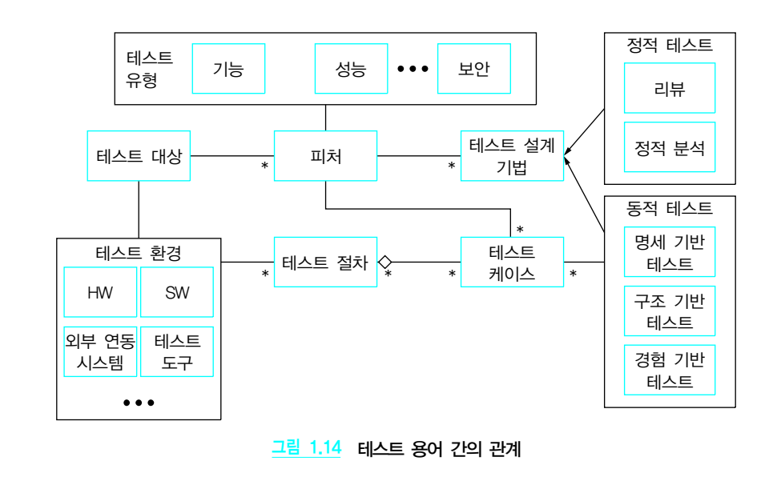

그림 1.14  테스트 용어 간의 관계
하나의 테스트 대상에 대하여 복수 개의 피처가 있을 수 있고, 이럴 경우 각 피처에 대한 테 스트가 수행된다. 피처로는 기능 피처와 성능, 보안 등을 다루는 비기능 피처가 있으며, 피 처에 초점을 둔 테스트를 유형 테스트라고 부른다.
피처를 테스트 할 때는 그에 적합한 테스트 설계기법을 적용하여 테스트를 수행해야 한다. 테스트 설계기법은 정적 테스트와 동적 테스트로 구분한다. 정적 테스트 방법으로는 리뷰 와 정적 분석이 있으며 동적 테스트 방법으로는 명세 기반 테스트, 구조 기반 테스트 그리 고 경험 기반 테스트가 있다.
동적 테스트 방법을 적용할 때 복수 개의 테스트 케이스가 설계된다. 테스트 케이스는 피처 에 따라, 즉, 테스트 대상의 특성 중에서 테스트하고자 하는 측면⋅관점에 따라 결정된다. 복수 개의 테스트 케이스가 특정 테스트 환경에서 수행될 수 있도록 순서를 정하면 이것이 테스트 절차가 된다. 또한, 하나의 테스트 케이스는 여러 테스트 절차에서 사용될 수 있다.

---
Exercise

--
01   소프트웨어 테스트에 관한 설명 중에서 올바른 것은 무엇인가?
① 프로그램의 오류를 발견하고 결함을 제거함으로써 프로그램의 품질을 높이는 활동이다.
② 테스트는 프로그램에 결함이 존재하지 않음을 보여 주기 위한 목적으로 수행한다.
③ 타당하지 않고 예상하지 못한 경우들에 대해서는 테스트를 수행하지 않아도 된다.
④ 프로그램을 가장 잘 이해하는 개발자가 직접 테스트를 수행하는 것이 효과적이다.

해설
② 테스트를 통하여 결함이 없음을 보여 주는 것은 현실적으로 불가능하다.
③ 타당하지 않고 예상하지 못한 경우에 대한 테스트를 반드시 수행해야 한다. 
④ 개발자가 아닌 다른 테스터가 테스트를 수행하는 것이 효과적이다.
--

02   완벽한 소프트웨어 테스트는 불가능하다. 다음 중 그 이유를 가장 잘 설명한 것은?
① 테스트 조직이 작아 할당할 수 있는 테스터가 적기 때문이다.
② 테스트 지식이 부족하고 테스트 전략과 계획의 완성도가 낮기 때문이다.
③ 개발 일정 대신 테스트 일정을 줄여 결과적으로 충분한 테스트 일정을 확보하지 못하기 때 문이다.
④ 무한 입력값, 무한 시간, 코드 내 무한 경로 등을 모두 고려해 테스트할 수 없기 때문이다.

해설
완벽한 테스트는 불가능하며, 이는 소프트웨어의 무한 입력값, 실행 시점의 무한 타이밍, 소프트웨어 코드 내 무한 경로 등을 모두 고려해 테스트할 수 없기 때문이다.

--
03   다음 중에서 품질 보증, 테스트, V&V의 관계를 가장 잘 표현하고 있는 것은? 
※ A ＜ B는 A의 개념보다 B가 더 광범위한 용어임을 의미한다. A = B는 A와 B가 동일한 범위를 가짐을 의미한다.
① 테스트 ＞ V&V = 품질 보증
② V&V = 테스트 ＜ 품질 보증
③ 테스트 ＜ V&V ＜ 품질 보증
④ V&V ＜ 테스트 ＜ 품질 보증

해설 : 테스트보다 V&V가 광범위 하고, V&V보다 품질 보증이 광범위하다.

--
04   테스팅과 디버깅에 대한 설명으로 올바르지 않은 것은 무엇인가? 
① 테스팅의 목적은 알려지지 않은 결함을 발견하는 것이다.
② 테스팅은 외부 개입을 배제하고, 시스템 내부관련자가 수행하는 것이다.
③ 디버깅은 이미 알고 있는 오류를 수정하는 것이다.
④ 디버깅의 주요 작업은 오류의 위치를 파악하고 이를 적절히 수정하는 것이다.

해설 : 테스팅의 목적은 알려지지 않은 결함을 발견하고자 하는 활동이고, 디버깅은 이미 알고 있는 오류를 수 정하는 활동으로 주로 오류의 위치를 찾고 이를 수정하는 작업이 이루어진다.

--
05   다음은 무엇에 대한 설명인가?
테스트가 테스트 요구사항을 얼마큼 만족하는지 나타내는 용어로 “테스팅 정도에 대한 양적 평가”를 결정하는 것이다. 이를 근거로 테스트를 얼마나 더 해야 할지 멈추어야 할지 결정할 수 있다.
① 테스트 효율성 ② 테스트 조건 ③ 테스트 케이스 실패율 ④ 테스트 커버리지
해설 : 테스트 커버리지에 대한 설명이다.

--
06   다음 중 결함(Defect)에 대한 설명으로 올바른 것은 무엇인가?
① 에러(Error)에 의해 발생되며 장애(Failure)의 원인이 될 수 있다.
② 결함이 실행되면 반드시 프로그램의 장애(failure)가 발생된다.
③ 프로그램의 실행 결과와 예상 결과와의 차이를 의미한다.
④ 사용자의 요구사항을 잘못 파악하거나 이해할 때 발생하는 실수를 말한다.

해설 :
① 결함은 에러에 의해서 발생하며, 장애의 원인이 될 수 있다.
② 결함이 실행된다고 반드시 장애가 발생하는 것은 아니다.
③ 장애에 대한 설명이다.
④ 에러에 대한 설명이다.

--

07   소프트웨어 테스트에서 결함은 프로그램의 모든 부분에 걸쳐 균일하게 분포되어 있다는 특성을 이용하여 테스트하는 것이 효과적이다. [○/×]
해설 : 프로그램 결함은 일부분의 모듈에 집중되어 나타난다.

--
08   다음 설명은 어떤 용어에 대한 설명인지 기재하시오.

∙ 에러의 타입을 식별(Fault Identification)하고, 에러를 수정(Fault Correction)하는 작업 이다.
∙ 에러의 정확한 위치를 파악(Fault Location)하는 작업이다. ∙ 시스템 내부 관련자가 수행한다.

--
09   다음 중 소프트웨어 테스트 활동에 대한 설명으로 올바른 것은 무엇인가?
① 결함의 위치를 파악하고 제거하는 것을 목적으로 한다.
② 결함 검출 및 제거를 목표로 하나, 소프트웨어 품질 개선을 목표로 하지 않는다.
③ 정해진 요구사항을 만족하는지 확인하고, 주어진 표준 등을 준수하는지 검증하는 활동이다.
④ 남아 있는 결함이 장애를 일으키지 않음의 증명을 통해 소프트웨어의 품질을 보증하는 활 동이다.

해설 : 
① 디버깅에 대한 설명 
② 테스트의 목적은 결함 검출, 품질 평가, 프로세스 개선과 소프트웨어 품질 개선이라고 볼 수 있다. ④ 남아 있는 결함이 장애를 일으키지 않음을 증명할 수 없다.

--
10   소프트웨어 개발 단계 중 어느 시점에 발견된 결함의 수정 비용이 가장 클 것으로 예상되 는지 다음 보기에서 찾아 쓰시오.

요구사항 정의, 운영 및 유지보수, 분석, 설계, 구현, 단위 테스트, 통합 테스트, 시스템 테스 트, 사용자 승인 테스트