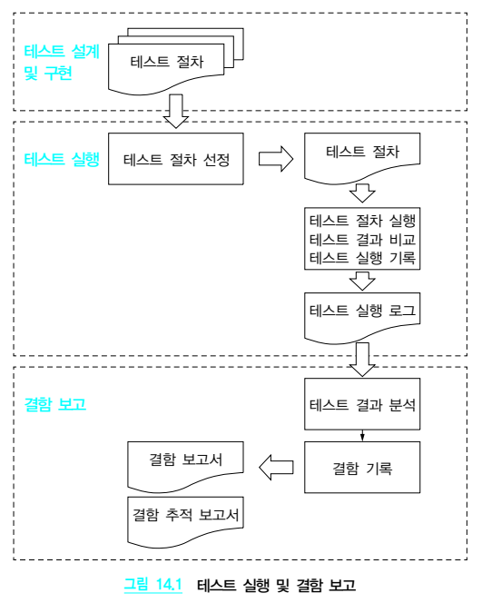

## 제14장 테스트 실행 및 결함 보고

--
14.1      개  요
테스트 실행 활동은 테스트 설계 및 개발 활동에서 개발된 테스트 절차들을 실행하여 실행 결
과를 테스트 실행 로그에 기록한다. 결함 보고 활동은 이러한 테스트 실행 로그를 분석하여 결
함들을 식별하고 이를 결함 보고서에 기록함으로써 검출된 결함의 해결을 시작할 수 있도록 
한다. 그림 14.1은 테스트 실행 활동과 결함 보고 활동이 수행되는 세부 작업을 보여 준다.

